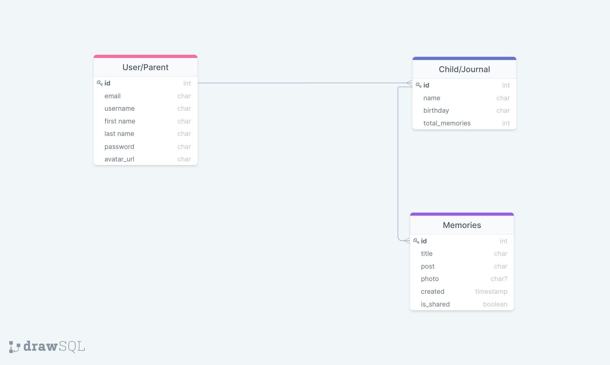

# remember_when
A web app to help you remember little things about your little ones.

**Scope**
When I became a parent, countless people told me to make a journal, just to jot down little milestones or sweet/funny/crazy memories. I thought I’d remember it all...but I don’t. Remember When is my solution to that problem -- an easily accessible and usable online ‘journal’ to save those little memories, to share with family and friends, and to save for you to share with your little ones when they have grown up.

A user will be able to register an account, log in, and begin to start saving memories. They can create a journal for each kid, and in any of those journals save a memory. This will be through a simple text entry, but a photo may be uploaded as well.

**User Stories**
The main people using the app will be parents or guardians of any child or children (or pet, or anything else they’d like to remember little things about).

For the MVP, the user will arrive at a splash page, which details what the app is all about. From there, they can login (or register for first-time users) and be directed to their home page, which is a collection of all their journals and a sampling of memories from them, displayed in a list. By default, each new user will have a new journal, which they can rename (or delete). There will be a button at the top of the page on the nav bar which brings up a form to create a new memory. On the form, there will be a dropdown menu to select which journal they wish to add a memory to. The same form will be used to edit any details, as well as show an option to delete a memory (a user can only view their own journal and memories by default). 

One feature is to allow an individual post to be made ‘public’, which then adds it to a randomized list of all public memories from all users. This list will be viewable to unregistered visitors to the page as well.

**Wireframes**

Splash Page

Login

Register

Shared Memories

All Show

Memory Show

Create Edit

Delete Prompt

**Data Models**
There will be 3 models in all: user, journal, and memory. Each user can have one or more journals (each signifying a different child), and each journal can have multiple memories associated with it. A stretch goal is to give user’s the chance to upload their own profile avatar, or have a selection of pre-defined avatars to choose from.

ERD

**Milestones**

Milestone 1 -- end of 9/9: Server and app initial setup, install dependencies, gitignore, stub out views for the homepage, all show, individual show.

Milestone 2 -- end of 9/10: 
Create all models and link to database, initial seed file to help with styling and function testing.
Milestone 3 -- end of 9/13: Flesh out styling on templates, create and refine modals for login, register, edit, and delete of memories, full AUTH.

Milestone 4 -- end of 9/15: Thorough testing of all CRUD functionality, error handling on all forms and submissions. Optimize responsive design for both mobile and full browser.

Stretch Goals: AWS S3 file bucket for user photo uploads (potentially audio files as well).

Technologies Used
Python, Django, Anaconda, PostgreSQL, DTL, Heroku (for deployment), AWS S3 (for photo uploads -- stretch)

